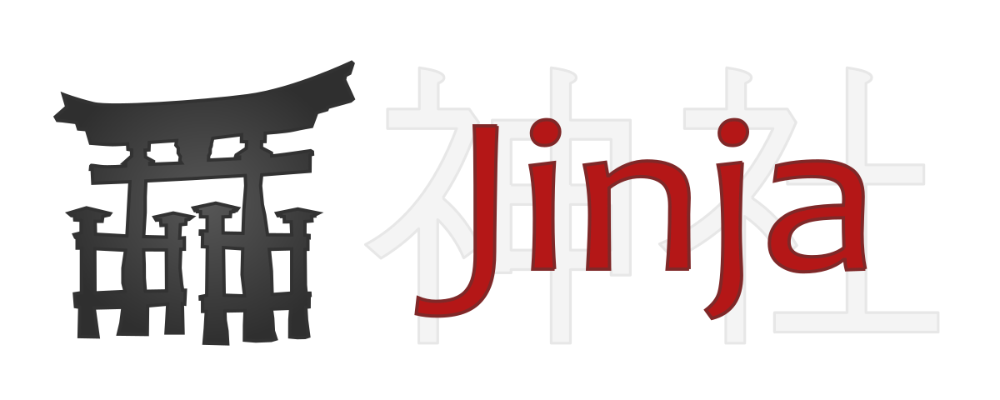

### `Jinja2` lessons from the YT channel "selfedu"  

**Exercise 1**  
*a.py* : About the templating engine, the use of {{ }} in templates  
*b.py* : Using substitution on the example of classes  
*c.py* : Using substitution on the example of the dictionary    
___
**Exercise 2**  
*a.py* : Using `raw` to ignore substitution  
*b.py*: HTML code shielding, also with `escape` from `markupsafe`  
*c.py*: Using `for` cycle for the dictionary  
*d.py*: Using `if` in `for` cycle in the dictionary  
___
**Exercise 3**  
*a.py*: Using filter `sum` to calculate the sum of the collection  
*b.py*: Using filter `max` to show the row with maximum price  
*c.py*: Filter block with `upper()` example  
*d.py*: Using `macro` for HTML template with `input`    
